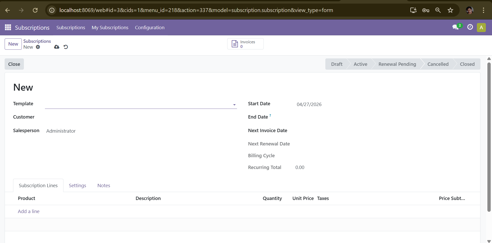
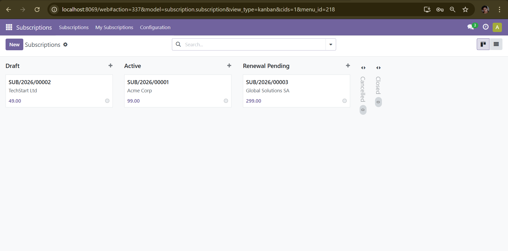
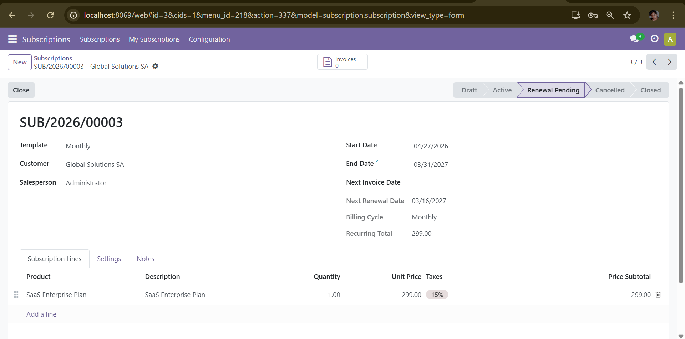

# odoo-subscription-manager

> Odoo 17 module — Recurring subscription management with automated billing, renewals, and customer portal.

[](https://www.odoo.com)
[](https://python.org)
[](https://www.gnu.org/licenses/lgpl-3.0)

## Screenshots

| Kanban Pipeline | List View | Form View |
|---|---|---|
|  |  |  |

## Features

- **Subscription Templates** — Define billing plans (monthly / quarterly / bi-annual / annual / custom) with default products, pricelist, and payment terms
- **Automated Invoicing** — Daily cron generates and posts invoices for all subscriptions due, then advances the next invoice date automatically
- **Auto-Renewal Engine** — Configurable lead time (N days before expiry), auto-renews contracts or sends reminder emails
- **Kanban Pipeline** — Drag & drop stage management with configurable stages (Draft → Active → Renewal Pending → Closed)
- **QWeb PDF Contract** — Printable subscription contract with service breakdown and signature blocks
- **Customer Portal** — `/my/subscriptions` — customers self-serve subscription overview and details
- **Renewal & Close Wizards** — Batch-renew multiple subscriptions, generate invoices on renewal, close with reason + optional email
- **Security Matrix** — Salesperson sees own subscriptions, Manager sees all; group-based record rules
- **Chatter & Tracking** — All state changes and actions logged in the chatter with field tracking

## Technical highlights

| Area | Implementation |
|---|---|
| Models | `subscription.subscription`, `subscription.template`, `subscription.line`, `subscription.stage`, `subscription.tag` |
| Inheritance | `res.partner` extended with subscription smart button |
| ORM | `@api.model_create_multi`, `@api.depends`, `@api.constrains`, `search_count`, `filtered` |
| Automation | 3 `ir.cron` jobs (invoice generation, renewal reminders, auto-renew) |
| Wizards | `TransientModel` — renew wizard + close wizard with multi-record support |
| Reports | QWeb PDF report with `ir.actions.report` binding |
| Portal | `CustomerPortal` extension — paginated list + detail view |
| Security | Custom groups, record rules with domain_force |
| Mail | 2 `mail.template` records — renewal reminder + close confirmation |

## Installation

```bash
# Clone into your Odoo addons directory
git clone https://github.com/Bayane-max219/odoo-subscription-manager.git

# Add to addons_path in odoo.conf
addons_path = /path/to/odoo/addons,/path/to/odoo-subscription-manager/..

# Install via CLI
python odoo-bin -d mydb -i odoo_subscription_manager

# Or via Odoo interface: Settings → Apps → search "Subscription Manager" → Install
```

**Dependencies:** `sale_management`, `account`, `portal`, `mail`

## Module structure

```
odoo-subscription-manager/
├── models/
│   ├── subscription.py          # Main model: invoicing, cron, kanban grouping
│   ├── subscription_template.py # Plan templates with billing config
│   ├── subscription_line.py     # Lines with pricelist integration
│   ├── subscription_stage.py    # Configurable pipeline stages
│   ├── subscription_tag.py      # Tagging system
│   └── res_partner.py           # Partner extension
├── wizards/
│   ├── subscription_renew_wizard.py   # Bulk renewal + invoice generation
│   └── subscription_close_wizard.py  # Close with reason + email
├── views/                       # Form, list, kanban, search views
├── reports/                     # QWeb PDF contract
├── controllers/portal.py        # Customer portal routes
├── data/                        # Stages, sequences, crons, mail templates
├── security/                    # Groups, record rules, ACL CSV
└── __manifest__.py
```

## Cron jobs

| Job | Frequency | What it does |
|---|---|---|
| `_cron_generate_invoices` | Daily | Creates + posts invoices for `next_invoice_date <= today` |
| `_cron_send_renewal_reminders` | Daily | Emails customers whose `next_renewal_date <= today` (manual-renew only) |
| `_cron_auto_renew` | Daily | Extends `date_end` for auto-renew subscriptions nearing expiry |

## Author

**Bayane Miguel Singcol** — Odoo Developer  
[GitHub](https://github.com/Bayane-max219) · baymi312@gmail.com
